# mac-bootstrap

Sets a brand-new Mac up for an agent workflow that has to behave identically under **Claude Code**
and **GitHub Copilot CLI 1.0.83**.

Readying one is part files a script can write, part gestures only a person can make — eighteen of
them plus one decision, and no script may take a single one for you. **So this is one entry point,
not one command:** it drives every drivable step, records each of the rest with its exact gesture,
and leaves you about four runs and roughly an hour, most of it waiting on Apple.

1. **[Clear the gates no script may pass for you](#1-clear-the-gates-no-script-may-pass-for-you)** → a Mac that can fetch, install and build
2. **[Decide what to install](#2-decide-what-to-install)** → a selection whose cost you know
3. **[Run it, and read the exit code](#3-run-it-and-read-the-exit-code)** → a receipt
4. **[Close out what the receipt says is yours](#4-close-out-what-the-receipt-says-is-yours)** → a verified machine

## 1. Clear the gates no script may pass for you

`lite` — the default — needs exactly one: **`terminal-emulator`**. An out-of-the-box Mac has only Terminal.app,
which has no equalize action, so `pane_equalize` has nothing to bind ⌘⇧E in; it records the gesture and
the run exits `10` until a terminal emulator exists. Every other row below is `standard` or `full`.
The driver detects and records each rather than attempting it, so doing them first only saves you a
re-run — and re-running after one is the recovery procedure, not a repair.

**You can skip all of it and start now.** `pane_equalize` is the only lite module that looks for an
installed app, so on a machine with nothing on it yet:

```bash
bash bootstrap.sh --profile lite --except pane_equalize
```

exits `0` with the status line, the instructions file and the lifecycle hooks all live — no
Homebrew, no sudo, no gesture of any kind. Install a terminal emulator whenever you like and
re-run plain `bash bootstrap.sh` to pick up ⌘⇧E.

Ordered by dependency: Homebrew installs the two below it, and nothing else here depends on
anything else here.

| | Gate | Exact gesture | Blocks |
|---|---|---|---|
| **`homebrew`** | Homebrew | `/bin/bash -c "$(curl -fsSL https://raw.githubusercontent.com/Homebrew/install/HEAD/install.sh)"` → RETURN → login password | the VoiceInk build, the local model, the screenshot pipeline — and `node`, therefore Copilot itself and the Microsoft 365 server |
| **`cmake`** | **cmake** — absent from `/usr/bin`, from Xcode *and* from the CLT, all three probed | `brew install cmake` | the VoiceInk build; whisper.cpp will not build |
| **`tmux`** | **tmux** — macOS ships none. Without it the drivers fall back to `direct` mode, where the successor dies with the terminal app | `brew install tmux` | `handoff`'s fault tolerance (`agent-handoff doctor` names it) |
| **`xcode-command-line-tools`** | Xcode Command Line Tools | if `/usr/bin/git --version` fails: `xcode-select --install` → **Install** → **Agree** | the VoiceInk build, and git everywhere — `/usr/bin/git` is an `xcrun` shim until these exist |
| **`terminal-emulator`** | **A terminal emulator** — a fresh Mac has Terminal.app and nothing else, so pane-equalize has nothing to bind | `brew install --cask iterm2` (or kitty) | ⌘⇧E pane equalize |
| **`agent-logged-in`** | **Agent installed and logged in.** Copilot is four gestures deep — macOS ships no `node` | Claude Code: `claude` → `/login` → browser OAuth. Copilot: `brew install node` → `npm i -g @github/copilot` → `copilot` → device flow (`gh auth login` also satisfies the last step) | everything on the agent path |
| **`copilot-seat`** | ⛔ **A decision, not a gesture: has this Mac a Copilot seat?** Unanswerable from a shell | Only you know. If not, `COPILOT_PROVIDER_BASE_URL` documents *"GitHub authentication is not required"* — an unentitled Mac can still run `copilot` against local Ollama | the Copilot half of every row |

One question first: clean install, or Migration Assistant? Migration carries existing TCC grants,
agent config and app secrets across, so the two verify different things — and on a migrated Mac,
rotate any API key that rode along. It is now a key on two machines.

## 2. Decide what to install

These run against the script you fetch in step 3; on the agent path, the prompt does this looking
for you and then asks which profile you want.

| | Command | |
|---|---|---|
| What is on offer, and what each costs | `bash bootstrap.sh --list` | writes nothing |
| What *this* invocation would do to *this* Mac | `bash bootstrap.sh --plan` | writes nothing |
| Every file it would write, with hashes | `bash bootstrap.sh --manifest` | writes nothing |
| The default | `bash bootstrap.sh` | acts |
| A bigger set | `bash bootstrap.sh --profile standard` · `--profile full` | acts |
| Exactly these | `bash bootstrap.sh --only statusline,pane_equalize` | acts |
| Everything but that one | `bash bootstrap.sh --profile full --except voiceink` | acts |

<!-- Diagram source: assets/diagrams/module-selection.mmd — edit it, run `npm run diagrams`, commit the SVGs. -->
<picture>
  <source media="(prefers-color-scheme: dark)" srcset="assets/diagrams/module-selection-dark.svg">
  
</picture>

Profiles are cut by blast radius; `lite` is the default because it is the largest set that asks
nothing of you and leaves nothing to clean up.

| Profile | You get | It costs |
|---|---|---|
| **lite** — the default | status line · instructions file · lifecycle hooks · ⌘⇧E pane equalize | config files only. No Homebrew, no permissions, no Apple ID, no network beyond the fetch — it asks nothing of you *once a terminal emulator is installed*, and records `terminal-emulator` until one is |
| **standard** | + `/handoff` self-recycle · a local speech-rewrite model · Outlook mail and calendar for both agents | Homebrew, tmux, node, a ~5 GB model download, one Microsoft sign-in |
| **full** | + the VoiceInk build · the screenshot pipeline | Xcode ~9 GB and an Apple ID, plus two permission toggles only you can grant |

`--verify` re-reads the machine cold and changes nothing; `--uninstall` reverses a run. Dependencies
resolve themselves and say so (`note: handoff needs statusline — adding it`); an unknown module
name is refused with the list of real ones, so it never selects nothing and calls that success.

## 3. Run it, and read the exit code

`0` all satisfied · `10` satisfied but for steps waiting on **you** · `20` something failed, read the
log · `30` the run could not assemble itself, so it is *not* a verdict about your machine (precedence
`30 > 20 > 10 > 0`, install and verify alike). It is idempotent — **re-running it is the recovery
procedure** — and writes only to `$HOME/.mac-bootstrap/`.

### If an agent is already running, paste this

Replace `ee25a157d7af06c2442573108dd186c2d0019c81` with the release commit — never `main`, whose
raw URL serves up to five minutes of stale CDN bytes (`cache-control: max-age=300`, measured). At
that pinned commit `bootstrap.sh` is 846 lines and `shasum -a 256` reads
`630f1f3e42b0ab4360576b8affb5ff84089575681b4fd1b67fb242c8a8c026fc`; step 1 shows you the checksum,
and anything else means stop. Fetched on its own it has no `modules/` beside it, so it makes a
second fetch, from the commit pinned *inside* it — which is this one's parent, because a commit
cannot contain its own sha. `scripts/release.sh --check` re-walks both hops anonymously, and CI
runs it on every push to `main`.

```text
You are setting up a Mac for an agent workflow. Work only in this terminal. Do not open a browser.

1. FETCH — never pipe a script into a shell. Save it, then show me its checksum and first lines:
     curl -fsSL -o /tmp/mac-bootstrap.sh https://raw.githubusercontent.com/renchris/mac-bootstrap/ee25a157d7af06c2442573108dd186c2d0019c81/bootstrap.sh
     shasum -a 256 /tmp/mac-bootstrap.sh && wc -l /tmp/mac-bootstrap.sh && head -20 /tmp/mac-bootstrap.sh
   If the download fails or the file is under 100 lines, stop and tell me. Do not find another source.

2. LOOK before touching anything. These two write NOTHING:
     bash /tmp/mac-bootstrap.sh --list
     bash /tmp/mac-bootstrap.sh --plan
   Then tell me in at most five lines: what the default (lite) would install here, and what
   standard and full would add and cost. Read the costs off --list; do not invent them.

3. ASK me which profile, and wait. Recommend one and say why in a sentence, based on what this
   machine already has. If I have already told you, skip this step and use what I said.
   Profiles: lite (config only) · standard (+ self-recycle, + a local model, + Outlook) · full (+ app build,
   + screenshots). You can also propose --only or --except if some single module is the real fit.

4. RUN it with my answer, e.g.  bash /tmp/mac-bootstrap.sh --profile standard
   It is idempotent; running it twice is the recovery procedure. It does nothing irreversible:
   anything needing a GUI permission, a keychain entry, sudo, an Apple ID or money is recorded
   for me, never attempted.
   Exit 0 = every selected module satisfied. 10 = some need me. 20 = something failed.
   30 = the run could not assemble itself and says nothing about the machine — fix that first.

5. READ $HOME/.mac-bootstrap/receipt.json. For each module whose state is FAILED: read
   $HOME/.mac-bootstrap/bootstrap.log, say the cause in one line, fix it only if the cause is
   yours, then re-run `--only <module>`. Never retry a module unchanged.

6. ONLY IF rewrite_model is in the selection — read the machine, then MEASURE. Never pick on size:
     bash assets/model-advisor.sh
   It writes nothing and prints this Mac's real budget for a model — which is not its RAM — plus
   the candidates that fit, each marked `measured-good`, `contested` or `unmeasured`. Take them in
   that order: `--only rewrite_model --bench <tag>` exits 0 on PASS, 1 on REJECTED, 2 if nothing
   was measured. Install the first that passes; if none passes, install nothing and say so.
   The full procedure, including the macOS 27 no-download path, is assets/agent-model-brief.md.
   Tell me the pick in one sentence, with the exit code that decided it.

7. VERIFY, then REPORT and stop.
     bash /tmp/mac-bootstrap.sh --verify
   Line 1: what is installed and verified. Then, for each thing that needs me: one line of plain
   English, then its single command alone on its own line in backticks, executable as typed.
   If I should not run it, do not show it. Do not ask me to confirm steps 1-2 or 4-7.

In force throughout: never edit my agent's permission settings, allowlists or credentials — if you
need a permission, ask me in chat. Never run sudo without showing me the exact command and waiting
for my yes. If a step needs a GUI gesture (a macOS permission prompt, Keychain Access, the App
Store, an Apple ID), do not attempt it: name the exact gesture and move on.
```

The repo, SHA, `curl`, "never pipe into a shell", exit codes and safety clauses are inline **because
they are the root of trust**: a safety rule fetched from the thing being trusted is not one.
Everything else is fetched — inline text is re-paid on every paste.

### If not, four lines — and read it before you run it

```bash
curl -fsSL -o /tmp/mac-bootstrap.sh https://raw.githubusercontent.com/renchris/mac-bootstrap/ee25a157d7af06c2442573108dd186c2d0019c81/bootstrap.sh \
  && shasum -a 256 /tmp/mac-bootstrap.sh \
  && less /tmp/mac-bootstrap.sh \
  && bash /tmp/mac-bootstrap.sh
```

Never `curl … | bash`. The `less` is the one second that makes this different from a pipe, and what
lets you re-read the exact bytes afterwards.

## 4. Close out what the receipt says is yours

`$HOME/.mac-bootstrap/receipt.json` carries every row below with its exact command; the driver
detected each and attempted none.

Ordered the way the run surfaces them: the VoiceInk build's own chain first, then the
permission toggles, then the two things only your eyes can settle.

| | Gate | Exact gesture | Blocks |
|---|---|---|---|
| **`xcode`** | Xcode itself, ~9 GB | App Store → Xcode → **Get** | the VoiceInk build |
| **`xcode-licence`** | Xcode licence + developer dir | `sudo xcodebuild -license accept`, then `sudo xcode-select -s /Applications/Xcode.app/Contents/Developer` | the VoiceInk build |
| **`code-signing-identity`** | **A code-signing identity** — a fresh Mac has none. An ad-hoc signature is silently revoked on every rebuild, taking Microphone and Accessibility with it, so the driver refuses to build without one | `bash ~/.mac-bootstrap/voiceink-signing-identity.sh` — written for you at the moment this row is recorded | the VoiceInk build |
| **`keychain-trust`** | Keychain trust dialog — **may not appear** | If it does, type your login password. Re-running after a cancel is safe | the VoiceInk build |
| **`gatekeeper-hammerspoon`** | Gatekeeper first launch of Hammerspoon | System Settings → Privacy & Security → scroll to Security → **Open Anyway** → authenticate | the screenshot pipeline |
| **`accessibility-hammerspoon`** | **Accessibility for Hammerspoon** — irreducible: `tccutil` only *resets*, and TCC writes are SIP-protected | System Settings → Privacy & Security → **Accessibility** → toggle **Hammerspoon** on. If absent: **+** → `/Applications/Hammerspoon.app` → Open | `screenshot` entirely |
| **`screen-recording`** | Screen Recording — believed unnecessary, never tested without it | Only if the thumbnail or copy fails after `accessibility-hammerspoon`: Privacy & Security → **Screen Recording** → enable Hammerspoon → **restart it** | `screenshot`, maybe |
| **`voiceink-permissions`** | VoiceInk Microphone + Accessibility | Click **OK** on the Microphone prompt. Then Privacy & Security → Accessibility → **+** → `~/Applications/VoiceInk.app` → toggle on | `voiceink` |
| **`transcription-model`** | Transcription model, ~1.5 GB, in-app, no CLI path | VoiceInk → AI Models → download **parakeet-unified-0.6b** (English, ANE-resident, self-punctuating) or `ggml-large-v3-turbo` | `voiceink` |
| **`voiceink-ollama-provider`** | **Selecting the Ollama provider inside VoiceInk** — GUI-only. A `defaults write` is not sufficient and can be wrong: the provider resolves **per mode**, and the fallback takes the first connected one in declaration order, where a cloud provider sits 10 places ahead of Ollama | VoiceInk → Settings → AI Models → **Ollama → Connect** → pick `voiceink-rewrite`. If any cloud key is still in the keychain, **also** pin Ollama on the active mode: Settings → Modes → *your mode* → AI Provider | `rewrite_model`'s whole point |
| **`microsoft365-sign-in`** | **Signing in to Microsoft 365** — a device-code flow in your browser; the token it mints is a credential only you can create. A work tenant may refuse Softeria's app: then IT approves it, or registers its own and you re-run with `BOOTSTRAP_MICROSOFT_CLIENT_ID=<that app's id>` | The one command the receipt prints (`… dist/index.js --login`) → open the URL → type the code → sign in with the work account → **Accept** | `microsoft365` |
| **`relaunch-iterm2`** | Relaunch iTerm2 — `NSUserKeyEquivalents` takes effect at the next launch | Quit and reopen iTerm2, split twice, drag a divider, press ⌘⇧E | `pane_equalize` |
| **`look-and-paste`** | **Two observations no script can make**, both on Copilot | (a) look at the status line for one second — does a percentage appear? (b) take a ⌘⇧4, then press **Ctrl+V**, not ⌘V, in the agent — does an image attach? | the two UNPROVEN rows below |

## What you get, and the three places Copilot differs

All of them work on Claude Code. On Copilot one is degraded and three are unproven — two of them
`look-and-paste`, one second of looking each, and the third a first Outlook tool call.

| Module | Deliverable | Claude Code | Copilot 1.0.83 | Notes |
|---|---|---|---|---|
| `statusline` | context-% in the agent status line | **DELIVERED** | **DELIVERED — painting UNPROVEN** | Execution on Copilot is proven 39×; whether it *paints* our stdout nobody has observed. Copilot renders a status line only in the interactive TUI, never under `-p`. |
| `instructions` | repo-agnostic instructions file | **DELIVERED** | **DELIVERED** | One `CLAUDE.md`, both agents measured loading it. The global tier is two paths bridged by one symlink: the content is one file, the paths cannot be. |
| `hooks` | agent lifecycle hooks | **DELIVERED** | **DELIVERED** | Identical scripts, two wrapper files: Copilot accepts Claude Code's PascalCase event names as a documented compatibility surface. Its `PreToolUse` fails **closed**, so every exit path is an explicit `0`. |
| `handoff` | self-recycle via `/handoff` | **DELIVERED** | **DEGRADED** | The *actuator* is identical and measured on both; the *typed gesture* is not. Copilot has no `/name` registration at all, so it is `/handoff` here and `copilot --agent handoff` there, and only the frontmatter description reaches Copilot's context. |
| `pane_equalize` | ⌘⇧E evens out split panes | **DELIVERED** | **DELIVERED** | Terminal-level, no agent involved. kitty gets `equalize_on_window_close` — its own docs name the wrong option, and the wrong spelling is a silent no-op. iTerm2 gets an undocumented native menu item via `NSUserKeyEquivalents`: no Python API, no Hammerspoon, no Accessibility grant. |
| `voiceink` + `rewrite_model` | local VoiceInk build + rewrite model | **DELIVERED — gated** | same | Agent-independent; gated on Xcode, `cmake`, a codesigning identity and TCC prompts. Fully scriptable **except** `voiceink-ollama-provider` — which is the point, because a surviving cloud key otherwise wins the provider race silently. |
| `microsoft365` | Outlook mail, calendar, contacts and OneDrive through a local MCP server | **DELIVERED — after your sign-in** | **REGISTERED — a live tool call UNPROVEN** | A node process each agent starts over stdio; it calls only `graph.microsoft.com` and `login.microsoftonline.com`, with no relay and no hosted part. Claude Code started it from the sandbox install and reported **Connected**; `copilot mcp get` reads the registration back **Enabled**. Tenant `organizations` by default (`BOOTSTRAP_MICROSOFT_TENANT` overrides it), and no `--org-mode`, whose Teams and SharePoint scopes need a tenant admin. Whatever a tool returns still goes to the agent's model provider. |
| `screenshot` | ⌘⇧4 → thumbnail → clipboard → paste | **DELIVERED** | **UNPROVEN** | The ⌘V→⌃V eventtap is required in every design: an image-only clipboard has zero text flavour, so ⌘V is a silent no-op in kitty and iTerm2 alike. On Copilot two dated primary sources point opposite ways and nobody ran the path. |

The design predicted a further `handoff` degradation — one human paste per recycle — and the oracle refuted
it: `fire` runs preflight → seed → launch → prove-engagement → retire with no per-recycle gesture,
its eight negative arms shipping as a runnable control (`bash assets/succession/oracle.sh selftest`,
44 tests). `RETIRED` is reachable only from `ENGAGED`; a timeout leaves the predecessor **up**:

<!-- Diagram source: assets/diagrams/succession-state-machine.mmd — edit it, run `npm run diagrams`, commit the SVGs. -->
<picture>
  <source media="(prefers-color-scheme: dark)" srcset="assets/diagrams/succession-state-machine-dark.svg">
  
</picture>

## What it will not do

**It never writes your agent's permissions, allowlists or credentials** — no `permissions.allow`,
`settings.local.json`, `allowedTools`, `apiKeyHelper` or keychain entry: it refuses the write and
asks you in chat, because a tool that can widen its own permissions has no permission model. It
**attempts no GUI, sudo, App Store or paid step**, **pipes nothing into a shell**, and **writes
nothing inside this repo**. Every module verifies by **independent read-back** — parsing the plist
with `plutil`, running the script against a synthetic payload, reading the pane geometry — never by
grepping for a phrase it just wrote or trusting an installer's exit code.

`bootstrap.sh` is the only entry point and `CONTRACT.md` the module spec it obeys; `verify.sh`
re-verifies cold into `receipt.verify.json`; `scripts/release.sh` cuts a release and refuses to
call it one until it has fetched every module and asset back anonymously. Diagram sources are `assets/diagrams/*.mmd` (`npm run
diagrams` renders, `diagrams:check` fails CI on a stale SVG). MIT licensed.
